# ReliaQuest Employee API - Flow Documentation

This document explains the end-to-end flow of the ReliaQuest Employee API using UML diagrams.

---

## Architecture Overview

The system consists of two Spring Boot applications:

- **API Module** (port `8111`) — Public-facing REST API consumed by clients
- **Server Module** (port `8112`) — Mock Employee data store with random rate limiting

---

## 1. System Component Diagram

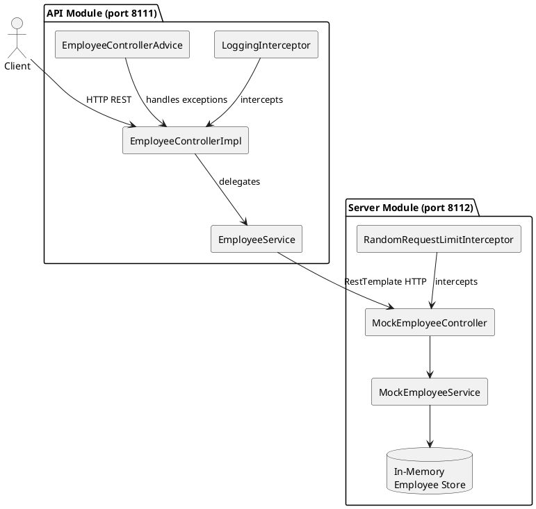

---

## 2. API Endpoints Flow

### 2a. GET All Employees

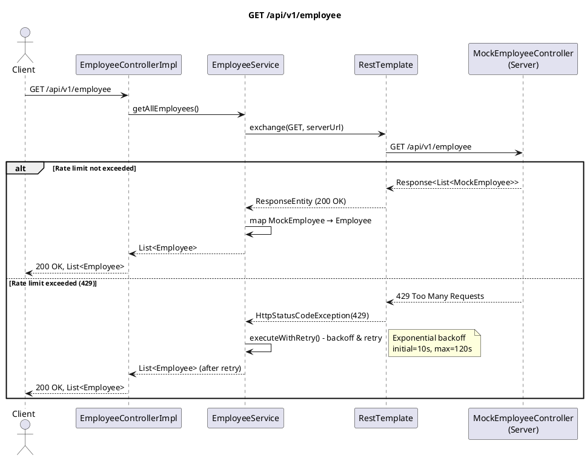

### 2b. GET Employee by ID

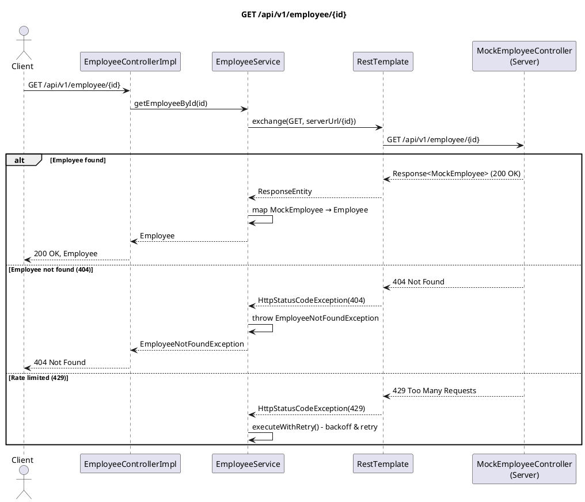

### 2c. GET Employees by Name Search

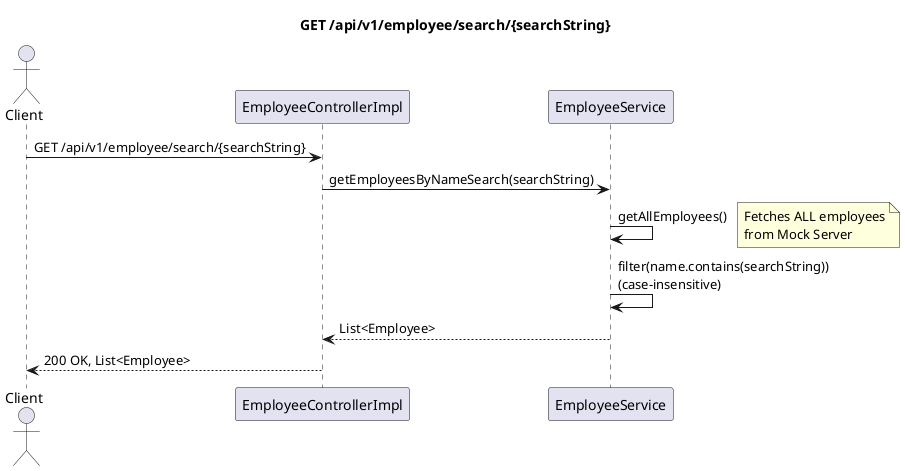

### 2d. GET Highest Salary

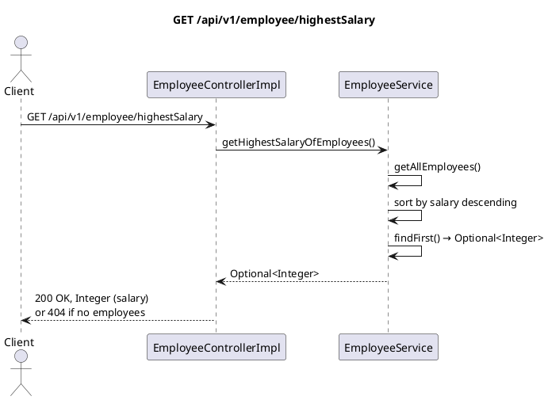

### 2e. GET Top 10 Highest Earning Employee Names

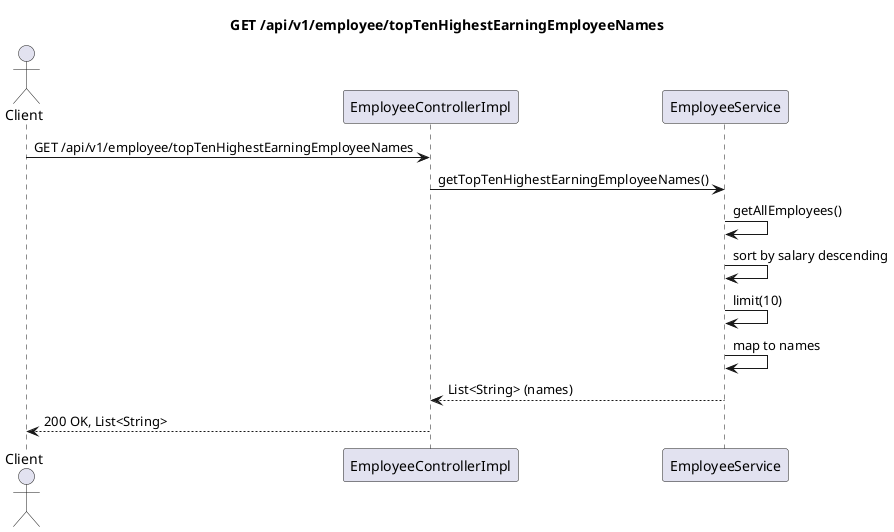

### 2f. POST Create Employee

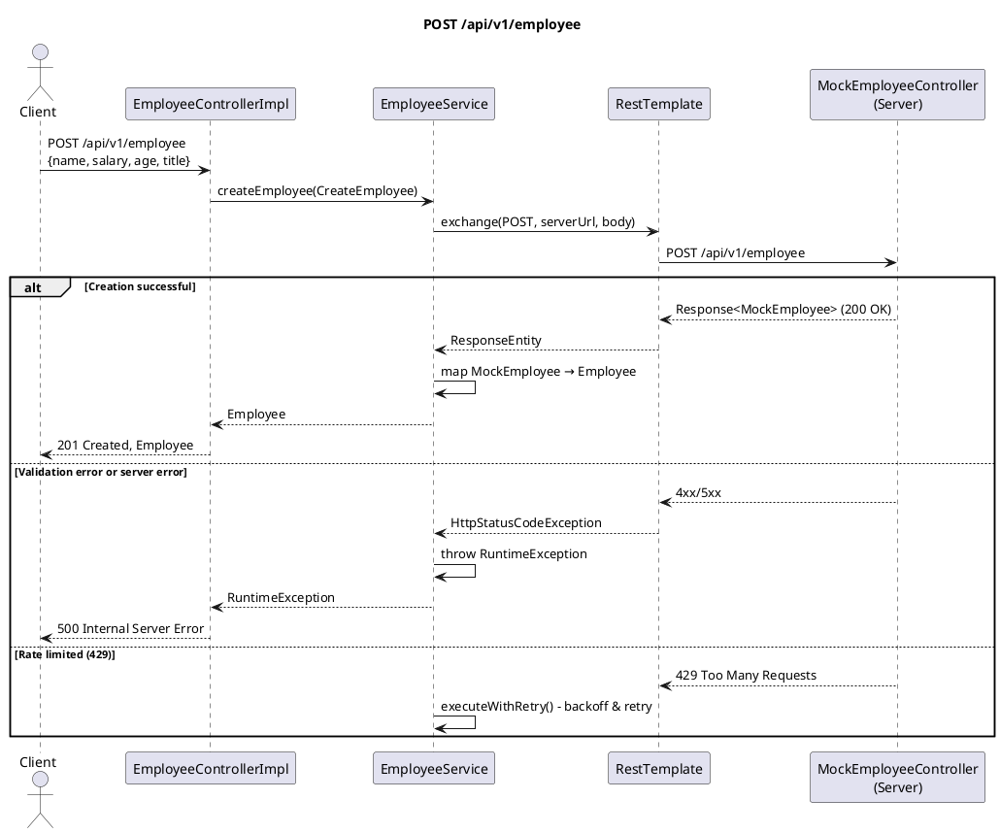

### 2g. DELETE Employee by ID

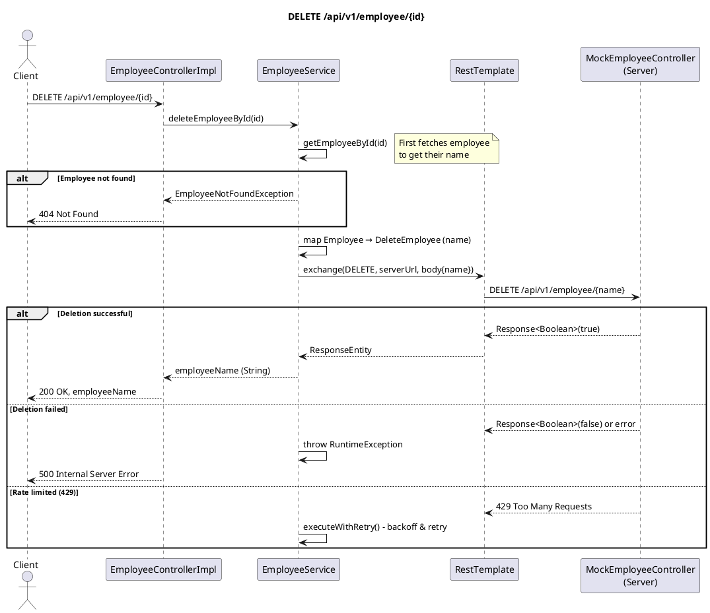

---

## 3. Retry / Rate-Limit Handling (executeWithRetry)

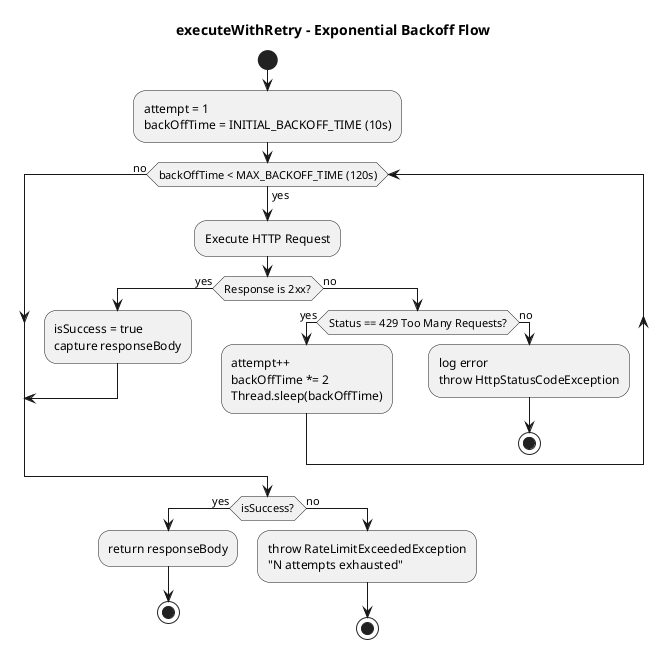

---

## 4. Server-Side Rate Limiting (RandomRequestLimitInterceptor)

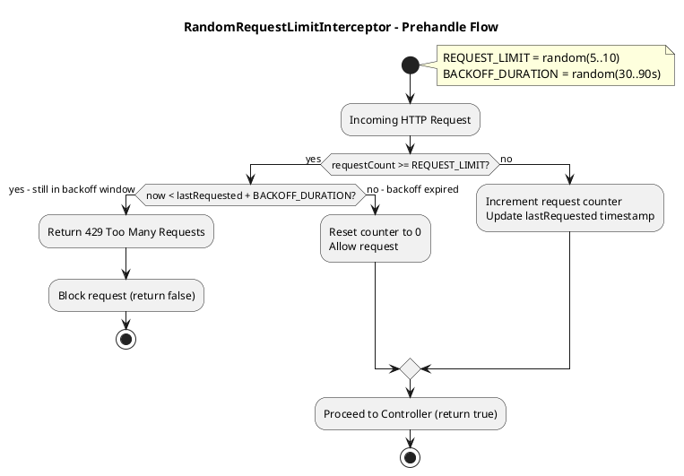

---

## 5. Exception Handling Flow

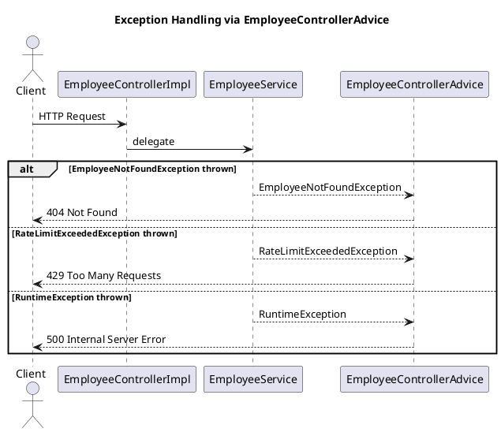

---

## 6. Data Model Mapping

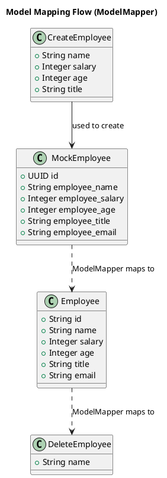

---

## Summary

| Endpoint | Method | Handler | Notes |
|---|---|---|---|
| `/api/v1/employee` | GET | `getAllEmployees` | Fetches all, maps via ModelMapper |
| `/api/v1/employee/search/{name}` | GET | `getEmployeesByNameSearch` | Fetches all, filters in-memory |
| `/api/v1/employee/{id}` | GET | `getEmployeeById` | Direct server lookup by UUID |
| `/api/v1/employee/highestSalary` | GET | `getHighestSalaryOfEmployees` | Fetches all, sorts, returns top salary |
| `/api/v1/employee/topTenHighestEarningEmployeeNames` | GET | `getTopTenHighestEarningEmployeeNames` | Fetches all, sorts, returns top 10 names |
| `/api/v1/employee` | POST | `createEmployee` | Delegates POST to mock server |
| `/api/v1/employee/{id}` | DELETE | `deleteEmployeeById` | Lookup by ID then delete by name |

All server calls go through `executeWithRetry()` with exponential backoff to handle the mock server's random rate limiting (429 responses).
